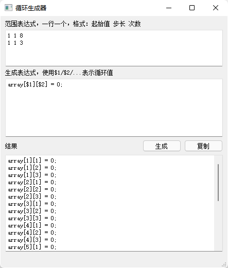

循环生成器
===

按照指定的数值、层数，重复生成指定文本模板，并将其中的 `$x` 标记替换为循环数值。

用于生成多维矩阵的代码，以及处理一些 Excel 中的局部递增效果。

范围表达式：每行 3 个整数，分别为：起始值 步长 次数。越上面的会越优先遍历。

生成表达式：文本模板，其中的 `$1` / `$2` 等会替换为上面表达式的真实变量值。

以下图为例：

范围有两行，表示循环两层，第一层从 1 循环到 8，第二层从 1 循环到 3，于是出现了图中的结果。

注意：生成结果为无分隔符的直接拼接，建议模板中最后带个换行或者所需分隔符。